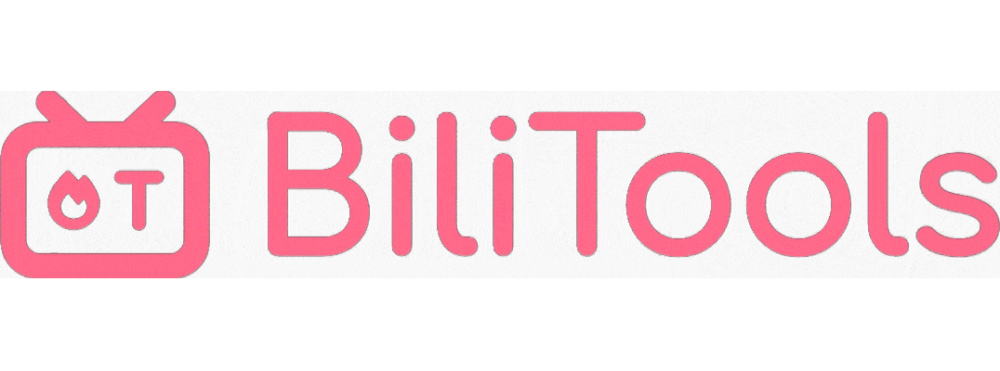

<p align="center">
    
</p>

<div align="center">
    <h1>BiliTools - 哔哩哔哩工具箱</h1>
    
    
    
    
    
    
    
    
</div>

## 介绍

基于 [Tauri v2](https://v2.tauri.app) 实现的哔哩哔哩工具箱

支持 `视频、番剧、课程、音乐、漫画` 等等资源下载与解析， 自动刷新登录信息等等

未来还会陆续支持更多功能，尽情期待~

将会优先适配 `Windows`, 次为 `macOS`, 暂不支持 `Apple Silicon`

关于应用使用说明，可以查看[博客](https://www.btjawa.top/bilitools)，其中也包含各种问题的解决方法

由于应用有涉及到登录等等敏感信息，请确保只在该项目的 `Release` 下载（或自行构建），不保证其他来源的安全性

## 功能

### 登录相关

| 功能           | 状态       |
|----------------|------------|
| 扫码登录       | ✅ 已完成  |
| 密码登录       | ❌ 不稳定  |
| 短信登录       | ✅ 已完成  |
| 自动刷新登录状态| ✅ 已完成  |
| Wbi 签名       | ✅ 已完成  |
| bili_ticket    | ✅ 已完成  |
| v_voucher      | ✅ 已完成  |
| buvid          | ✅ 已完成  |

### 资源解析

| 功能    | 状态    | 备注                      |
|---------|---------|---------------------------|
| 视频    | ✅ 已完成 | 全分辨率 + HDR + 杜比    |
| 音频    | ✅ 已完成 | 全比特率 + 杜比 + Hi-Res |
| 音乐    | ✅ 已完成 | 全比特率 + 无损 FLAC     |
| 互动视频 | ✅ 已完成 |                        |
| 封面    | ✅ 已完成 |                         |
| AI总结  | ✅ 已完成 | MD Markdown格式         |
| 历史弹幕 | ✅ 已完成 | ASS 字幕格式            |
| 实时弹幕 | ✅ 已完成 | ASS 字幕格式            |
| 漫画    | ❌ 不稳定 | 见下                    |

### 关于漫画
 - 使用新版API接口，可获得一话中大部分图像，仅个别图像格式不正确
 - 目前有一个获取全部图像的方法，但是极不稳定，因此不考虑添加此功能

### 国际化 I18N

| 语言代码       | 状态       |
|----------------|------------|
| zh-CN          | ✅ 已完成  |
| zh-HK          | ✅ 已完成  |
| ja-JP          | ✅ 已完成  |
| en-US          | ✅ 已完成  |

## TODO 列表

 - [x] 自定义文件名格式
 - [ ] 元信息快照
 - [ ] SOCKS 代理
 - [ ] 完善密码登录
 - [ ] 完善漫画解析
 - 可以在 Issue 中提出想要的新功能

## 本地开发 / 构建

### 开发

```shell
// Require Rust stable, edition 2021
git clone https://github.com/btjawa/BiliTools.git
cd BiliTools
npm install // You can use pnpm, yarn as replacement
npm run tauri dev
```

### 构建

```shell
// Require Rust stable, edition 2021
git clone https://github.com/btjawa/BiliTools.git
cd BiliTools
npm install // You can use pnpm, yarn as replacement
npm run tauri build
```

## 声明

本项目仅作学习用途，作者不承担因使用本项目而导致的一切后果，若有侵权，可随时联系删除

本项目的代码部分依据 [MIT 许可证](https://opensource.org/license/mit) 授权，请参考项目根目录下的 `LICENSE` 文件。

本项目参考了 [bilibili-API-collect](https://github.com/SocialSisterYi/bilibili-API-collect) 项目的内容，由 [SocialSisterYi](https://github.com/SocialSisterYi) 根据 [CC BY-NC 4.0](https://creativecommons.org/licenses/by-nc/4.0/deed.en) 协议发布，并仅限于非商业用途。

### 使用的其他开源项目

 - [aria2](https://github.com/aria2/aria2)

 - [ffmpeg](https://git.ffmpeg.org/ffmpeg.git)

 - [DanmakuFactory](https://github.com/hihkm/DanmakuFactory)

 - 其余可查看 `package.json` 与 `src-tauri/Cargo.toml`
