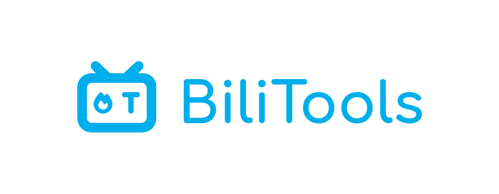

<h1>BiliTools - A Bilibili Toolbox</h1>

[简体中文](./README.md) | English | [日本語](./README_JA.md) | [ChangeLog](./CHANGELOG.md) | [Contributing](./CONTRIBUTING.md) | [CODE_OF_CONDUCT](./CODE_OF_CONDUCT.md)

💡 A simple & light-weight Bilibili toolbox, Powered by [Tauri v2](https://github.com/tauri-apps/tauri).

- 📖 Documents: [https://bilitools.btjawa.top](https://bilitools.btjawa.top) 

- 🧾 Other infos: [https://btjawa.top/bilitools](https://btjawa.top/bilitools)

- 🚀 Downloads: [Releases](https://github.com/btjawa/BiliTools/releases)

For installation instructions, guides and FAQs, please refer to the documents.

> [!IMPORTANT] 
> **This project is built for [Bilibili China](https://www.bilibili.com). We do NOT support the [Bilibili Overseas](https://www.bilibili.tv).** 
> Accessing **VIP / Paid** content is only available for accounts that have an active subscription to the corresponding service. 

## 🧪 Features

| Resources       | Status       | Notes |
|-----------------|--------------|-------|
| Video        | ✅ Completed | <ul><li>Collections, Episodes, Interactive, Bangumi, Courses, Movies</li><li>Support DASH, MP4, FLV</li><li>Support 4K, 8K, HDR, Dolby Vision</li></ul> |
| Audio        | ✅ Completed | <ul><li>AVC, HEVC, AV1 codecs</li><li>Support Dolby Atmos, Hi-Res</li></ul> |
| History Danmaku | ✅ Completed | <ul><li>ASS / XML Format</li><li>Could parse almost all the segments in the danmaku pool</li></ul> |
| Live Danmaku | ✅ Completed | ASS / XML Format |
| Music        | ✅ Completed | Loseless FLAC, 320Kbps audios / playlists |
| Thumbnail    | ✅ Completed | Bangumi / Movie posters / Season Thumbnail / Courses Preview, etc |
| Subtitles    | ✅ Completed | SRT Format |
| Favorites    | ✅ Completed | Parsing with FID numbers |
| NFO Scraper  | ✅ Completed | Season / Episode Scraping |
| Metadata     | ✅ Completed | Audio files support writing basic metadata |
| AI Summary   | ✅ Completed | Markdown format，From Bilibili `AI assistant` |

| Login & Auths  | Status       | Misc | Status      |
|----------------|--------------|------|-------------|
| Scan login     | ✅ Completed | Light & Dark Theme | ✅ Completed |
| Password login | ✅ Completed | Clipboard Monitor  | ✅ Completed |
| SMS login      | ✅ Completed | HTTP Proxy         | ✅ Completed |
| Auto refresh login state | ✅ Completed | PCDN Filter | ✅ Completed
| Params signing | ✅ Completed | MP3 Converter      | ✅ Completed |
| Risk ctrl      | ✅ Completed | Naming Format      | ✅ Completed |
| Fingerprint    | ✅ Completed | Watch History      | ✅ Completed |

## 🚀 Contributing

> [!TIP]
> ### This project will enter a stable state and updates will be put on hold after the release of `1.4.0` REL.

Everyone is welcome to contribute and help improving this project!

Please use [Contributing](./CONTRIBUTING.md) as a reference~

When submitting an Issue, please provide enough info so the maintainer could solve your problems.

## 🌎 Internationalization

**Simplified Chinese (zh-CN)** is the primary language maintained, and acts as the source for other translations.

| Code           | Status      |
|----------------|-------------|
| zh-CN          | ✅ Complete |
| zh-HK          | ✅ Complete |
| en-US          | ✅ Complete |
| ja-JP          | ✅ Complete |

## ⚡ Donate

If you found it helpful, please consider buying me a coffee via [爱发电 (afdian)](https://afdian.com/a/BTJ_Shiroi) ~

Your support will be a great motivation for [me](https://github.com/btjawa) to keep improving!

## 💫 Special Thanks

 

- [tauri](https://github.com/tauri-apps/tauri) Build smaller, faster, and more secure desktop and mobile applications with a web frontend.

- [aria2](https://github.com/aria2/aria2) aria2 is a lightweight multi-protocol & multi-source, cross platform download utility.
- [FFmpeg](https://git.ffmpeg.org/ffmpeg.git) FFmpeg is a collection of libraries and tools to process multimedia content.
- [DanmakuFactory](https://github.com/hihkm/DanmakuFactory) 支持特殊弹幕的xml转ass格式转换工具
- [bilibili-API-collect](https://github.com/SocialSisterYi/bilibili-API-collect) 哔哩哔哩-API收集整理

- [Vercel](https://github.com/vercel/vercel) Develop. Preview. Ship.
- [m4s-converter](https://github.com/mzky/m4s-converter) Convert Bilibili m4s format to MP4 format

<a href="https://www.star-history.com/#btjawa/BiliTools&Date" alt="Star History Chart">
<picture>
<source
    media="(prefers-color-scheme: dark)"
    srcset="https://api.star-history.com/svg?repos=btjawa/BiliTools&type=Date&theme=dark"
/>
<source
    media="(prefers-color-scheme: light)"
    srcset="https://api.star-history.com/svg?repos=btjawa/BiliTools&type=Date"
/>

</picture>
</a>

## Disclaimer

> [!IMPORTANT]
> This project is licensed under [GPL-3.0-or-later](/LICENSE). It is free and open-source: 
> Any redistribution must **remain open-source, use the same license, and retain all original and copyright information**.

**This project is intended to study and testing code. DO NOT ABUSE IT!**

We **strongly oppose and do not condone** any form of piracy, unauthorized redistribution, illicit activities, or other illegal uses.

- Any consequences arising from the use of this project (including but not limited to illegal use, account restrictions, or other losses) are solely the responsibility of the user and have no relation to [the author](https://github.com/btjawa), who assumes no liability.
- This project is free and open-source, I have not obtained any financial gain from it.
- This project does not bypass authentications, crack paid resources, or conduct any other illegal activities.
- All data generated and acquired will be stored locally using `SQLite`:

> Windows: `%AppData%\com.btjawa.bilitools` 
> macOS: `$HOME/Library/Application Support/com.btjawa.bilitools` 
> Linux: `$HOME/.local/share/com.btjawa.bilitools`

- The names and logos of “哔哩哔哩” and “Bilibili”, as well as related graphics, are registered trademarks or trademarks of Shanghai Hode Information Technology Co., Ltd.
- This project has no affiliation, cooperation, authorization, or endorsement relationship with Bilibili or its associated companies.
- The copyright of any content obtained through this project belongs to the original rights holders. Please comply with relevant laws, regulations, and platform service agreements.
- If there is any infringement, feel free to [contact](mailto:btj2407@gmail.com) us.